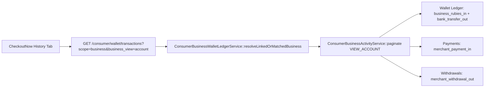

# Business History — Backend Architecture & Diagnostics

This document covers the unified business transaction History architecture, API contract with CheckoutNow, cache lifecycle, curl diagnostics, and troubleshooting procedures for operations and support engineers.

---

## 1. Overview & Architecture

When a consumer wallet is linked to a CheckoutPay merchant business (via Admin link, Merchant PIN link, or Business Onboarding), the transaction History endpoint merges:
1. **Wallet ledger rows** (`whatsapp_wallet_transactions` where `ledger_scope = 'business'`)
2. **Merchant payment rows** (`payments` table for `business_id`)
3. **Merchant payout / withdrawal requests** (`withdrawal_requests` table for `business_id`)



### Views: `account` vs `full`

| Parameter | View Purpose | Included Types | Use Case |
| :--- | :--- | :--- | :--- |
| `business_view=account` | **History Tab** | `merchant_payment_in`, `business_rubies_in`, `bank_transfer_out`, `merchant_withdrawal_out` | Business Account History (Inflows & Outflows) |
| `business_view=full` | **Utility Tab** | All `ledger_scope=business` rows (including VTU, P2P transfers, fee debits, savings locks) + Merchant payments + Withdrawals | Utility Statements & Full Audit |

---

## 2. API Contract (CheckoutNow)

### Endpoint
```http
GET /api/v1/consumer/wallet/transactions?scope=business&business_view=account&page=1&per_page=20
```

### Query Parameters

| Parameter | Type | Required | Description |
| :--- | :--- | :--- | :--- |
| `scope` | `string` | **Yes** | Must be `business` for business transactions. |
| `business_view` | `string` | **Yes** | Use `account` for the History tab. Defaults to `full` if omitted. |
| `page` | `integer` | No | Page number (1-based, default `1`). |
| `per_page` | `integer` | No | Items per page (min `1`, max `50`, default `20`). |
| `from` | `string` (YYYY-MM-DD) | No | Start date boundary. Defaults to 12 months ago if empty. |
| `to` | `string` (YYYY-MM-DD) | No | End date boundary. Defaults to current date if empty. |
| `refresh` | `1` or `true` | No | Forces cache invalidation for the current date range (use on pull-to-refresh). |

### UI Gating Contract
The mobile client gates the Business History UI on `business_wallet_enabled` from `GET /api/v1/consumer/wallet`:
```json
{
  "success": true,
  "data": {
    "business_wallet_enabled": true,
    "business_balance": 154200.50,
    "linked_business_id": 42,
    "linked_business_name": "Apex Retail Store"
  }
}
```

---

## 3. Response Structure & Metadata

### Success Response
```json
{
  "success": true,
  "data": [
    {
      "id": -105,
      "whatsapp_wallet_id": 12,
      "type": "merchant_payment_in",
      "ledger_scope": "business",
      "amount": 15000.00,
      "balance_after": null,
      "counterparty_account_name": "Tunde Bakare",
      "external_reference": "TX-984210",
      "created_at": "2026-08-20T14:23:10+01:00",
      "meta": {
        "payment_id": 105,
        "business_id": 42,
        "status": "approved",
        "label": "Website payment · apexstore.ng"
      }
    },
    {
      "id": 4012,
      "whatsapp_wallet_id": 12,
      "type": "bank_transfer_out",
      "ledger_scope": "business",
      "amount": 5000.00,
      "balance_after": 149200.50,
      "counterparty_account_name": "Supplier Logistics Ltd",
      "created_at": "2026-08-19T10:15:00+01:00",
      "meta": {}
    }
  ],
  "meta": {
    "current_page": 1,
    "last_page": 4,
    "per_page": 20,
    "total": 68,
    "scope": "business",
    "from": "2025-08-23",
    "to": "2026-08-23",
    "timezone": "Africa/Lagos",
    "business_id": 42,
    "includes_merchant_activity": true,
    "business_view": "account",
    "refreshed": false
  }
}
```

### Stale / Broken Link Response
If `linked_business_id` is set on the wallet but the merchant record no longer exists in the database:
```json
{
  "success": true,
  "data": [],
  "meta": {
    "current_page": 1,
    "last_page": 1,
    "per_page": 20,
    "total": 0,
    "scope": "business",
    "from": "2025-08-23",
    "to": "2026-08-23",
    "timezone": "Africa/Lagos",
    "includes_merchant_activity": false,
    "merchant_link_broken": true,
    "business_view": "account",
    "message": "Linked merchant account could not be loaded. Contact support or re-link in admin."
  }
}
```

---

## 4. Synthetic ID Conventions

Merged merchant items do not require prior wallet ledger entries. They are synthesized on the fly:
- **Merchant Payments (`merchant_payment_in`)**: `id = -1 * payment.id` (e.g. `-105`).
- **Merchant Withdrawals (`merchant_withdrawal_out`)**: `id = -1_000_000_000 - withdrawal.id` (e.g. `-1000000042`).
- **Wallet Transactions (`business_rubies_in`, `bank_transfer_out`)**: Positive integers (native primary keys).

> [!IMPORTANT]
> The mobile client must NOT filter out transactions with negative IDs or treat them as errors. Negative IDs uniquely identify synthetic merchant entries and prevent key collisions with `whatsapp_wallet_transactions`.

---

## 5. Cache Lifecycle & Invalidation

Merged transaction lists are cached on the server to prevent heavy multi-table joins and sorts on repeated visits:
- **Key Pattern**: `consumer_biz_activity:v2:{wallet_id}:{business_id}:{generation}:{from}:{to}:{view}`
- **TTL**:
  - `account` view: 10 minutes (`consumer_wallet.business_activity_cache_ttl_account`).
  - `full` view: 30 minutes (`consumer_wallet.business_activity_cache_ttl_full`).

### Cache Invalidation Triggers
- **Pull-to-refresh**: Passing `refresh=1` clears the specific date-range key for that view.
- **Link / Unlink Events**: Calls `ConsumerBusinessActivityService::forgetWalletCaches($wallet)`, incrementing the wallet's cache generation key (`consumer_biz_activity_wallet_gen:{wallet_id}`). This instantly invalidates all cached ranges and views for that wallet without flushing unrelated redis keys.
  - Admin wallet link/unlink (`WhatsappWalletAdminController::linkBusiness`).
  - Merchant self-service link/unlink (`BusinessWhatsappWalletLinkService::link` / `unlink`).
  - Business onboarding workflow (`BusinessAccountOnboardingWorkflowService`).

---

## 6. Live Verification & Diagnostic Commands

Run these curl commands using an active Consumer JWT Bearer token:

### 1. Check Wallet & Business Link Status
```bash
curl -sS -H "Authorization: Bearer $TOKEN" \
  "https://check-outpay.com/api/v1/consumer/wallet" \
  | jq '.data | {business_wallet_enabled, linked_business_id, linked_business_name, business_balance}'
```
*Expected*: `business_wallet_enabled: true`, `linked_business_id` is an integer, and `business_balance` matches the merchant balance.

### 2. Fetch Business History (Account View)
```bash
curl -sS -H "Authorization: Bearer $TOKEN" \
  "https://check-outpay.com/api/v1/consumer/wallet/transactions?scope=business&business_view=account&refresh=1&per_page=20" \
  | jq '{meta, types: [.data[].type]}'
```
*Expected*:
- `meta.includes_merchant_activity`: `true`
- `meta.business_view`: `"account"`
- `meta.business_id`: matching integer
- `types`: array containing `merchant_payment_in`, `merchant_withdrawal_out`, `business_rubies_in`, and/or `bank_transfer_out`.

### 3. Fetch Full Business Statement (Utility View)
```bash
curl -sS -H "Authorization: Bearer $TOKEN" \
  "https://check-outpay.com/api/v1/consumer/wallet/transactions?scope=business&business_view=full&per_page=20" \
  | jq '{meta, total: .meta.total}'
```

---

## 7. Troubleshooting Empty History

If a user reports that their History tab is empty or missing merchant payments:

1. **Verify Link Exists**:
   - Inspect `whatsapp_wallets.linked_business_id`.
   - If `linked_business_id` is `null`, check if the wallet's `phone_e164` matches a verified merchant phone.
2. **Check for Broken Link**:
   - Query the API with `scope=business`. If `meta.merchant_link_broken` is `true`, the linked business ID does not exist in `businesses` table. Re-link the wallet in the admin panel.
3. **Verify App View Parameter**:
   - Verify the mobile app is calling `business_view=account`. If the app passes an invalid view or client-filters transactions, rows will not display.
4. **Check Date Range**:
   - The default range is the last 12 months. If the transactions occurred earlier, specify explicit `from=YYYY-MM-DD` and `to=YYYY-MM-DD`.
5. **Pull-to-Refresh / Cache**:
   - If a merchant payment was matched just seconds ago, perform a pull-to-refresh in the app or pass `refresh=1` in curl to bypass the 10-minute cache.
6. **Payment Status**:
   - Only merchant payments in `payments` with `business_id = ?` and `status = 'approved'` (or matching date boundaries) are displayed. Check payment status in merchant dashboard or admin.
